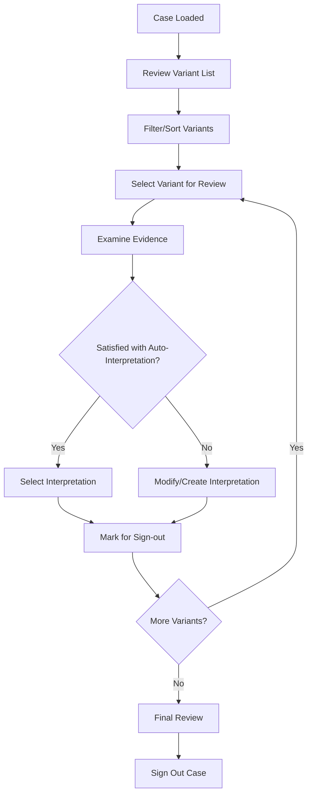

# Frontend Specification Blueprint

## Overview

This document defines the frontend interface based on proven patterns from leading clinical annotation tools (PCGR, Scout, IVA, CIViC, OncoKB, cBioPortal). We adopt a **multi-tier reporting approach** with **Scout-style curation** and **PCGR-inspired visualization**.

## Frontend Architecture

### Primary Templates & Implementation Strategy

**Primary Templates:**
- **Scout** (Clinical Genomics): Clinical variant review interface, curation workflows
- **PecanPie**: Alternative clinical genomics UI patterns for comparison
- **PCGR**: Report structure and visualization patterns (re-implement clean)

**Implementation Approach:**
- **Scout/PecanPie Patterns:** Emulate proven clinical genomics UI workflows
- **Clean Re-implementation:** Build modern React interface following their patterns
- **No External Dependencies:** Self-contained frontend with our API backend

### Core Principles (Based on Industry Leaders)

1. **Multi-Tier Reporting** (PCGR pattern, re-implemented): JSON → Interactive HTML → Curation UI → PDF
2. **Scout-Style Curation** (Clinical Genomics pattern): Audit trails, tier overrides, sign-off workflows
3. **Evidence-First Display** (CIViC pattern): Transparent evidence sources and reasoning  
4. **Real-Time Collaboration** (Placeholder - Post-MVP): Live updates and concurrent editing

## User Interface Structure

### 1. Application Layout

Following **Scout's** clinical genomics interface with **PCGR's** reporting structure:

```
┌─────────────────────────────────────────────────────────┐
│ Header: Case Info | User | Status | Actions             │
├─────────────────────────────────────────────────────────┤
│ Navigation: Overview | Variants | Biomarkers | Reports  │
├─────────────────────────────────────────────────────────┤
│                                                         │
│ ┌─────────────────┐ ┌─────────────────────────────────┐ │
│ │   Variant List  │ │      Variant Detail Panel      │ │
│ │                 │ │                                 │ │
│ │ □ TP53 p.R273H  │ │ ┌─ Genomic Information ────────┐ │ │
│ │   Tier I        │ │ │ Gene: TP53                    │ │ │
│ │   Pathogenic    │ │ │ cDNA: c.818G>A                │ │ │
│ │                 │ │ │ Protein: p.Arg273His          │ │ │
│ │ □ EGFR L858R    │ │ │ Consequence: missense_variant │ │ │
│ │   Tier I        │ │ └───────────────────────────────┘ │ │
│ │   Actionable    │ │                                 │ │ │
│ │                 │ │ ┌─ Knowledge Base Evidence ────┐ │ │
│ │ □ KRAS G12C     │ │ │ OncoKB: Oncogenic (Level 1)   │ │ │
│ │   Tier II       │ │ │ ClinVar: Pathogenic (★★★★)   │ │ │
│ │   Emerging      │ │ │ CIViC: Evidence Level A       │ │ │
│ │                 │ │ │ COSMIC: Hotspot (156 samples) │ │ │
│ │ Filters:        │ │ └───────────────────────────────┘ │ │
│ │ [All Tiers ▼]   │ │                                 │ │ │
│ │ [Gene Search]   │ │ ┌─ Clinical Interpretation ────┐ │ │
│ │ [Actionable ☑]  │ │ │ Tier: I (Confidence: 95%)     │ │ │
│ │                 │ │ │ Significance: Pathogenic      │ │ │
│ └─────────────────┘ │ │ Guidelines: AMP/ACMG 2017     │ │ │
│                     │ │ Rules: PS1, PM1, PP3          │ │ │
│                     │ │                               │ │ │
│                     │ │ Selected Interpretation:      │ │ │
│                     │ │ [Existing Template ▼] [Edit]  │ │ │
│                     │ └───────────────────────────────┘ │ │
│                     └─────────────────────────────────┘ │
│                                                         │
├─────────────────────────────────────────────────────────┤
│ Footer: Status | Progress | Last Updated                │
└─────────────────────────────────────────────────────────┘
```

### 2. Component Architecture

Based on **React** patterns from **cBioPortal** and **CIViC**:

```typescript
// Component hierarchy following cBioPortal patterns
interface ComponentHierarchy {
  App: {
    CaseProvider: {
      Header: {
        CaseInfoDisplay: any;
        UserMenu: any;
        ActionButtons: any;
      };
      Navigation: {
        TabNavigation: any;
      };
      MainContent: {
        VariantListView: {
          VariantTable: any;
          FilterPanel: any;
          ExportControls: any;
        };
        VariantDetailView: {
          GenomicInfoPanel: any;
          EvidencePanel: any;
          InterpretationPanel: any;
          CannedTextPanel: any;
        };
      };
      Footer: {
        StatusBar: any;
        ProgressIndicator: any;
      };
    };
  };
}
```

## User Workflow Design

### 1. Case Review Workflow

Following **Scout's** clinical review patterns:



### 2. Variant Interpretation Workflow

Based on **CIViC's** curation interface:

```typescript
interface InterpretationWorkflow {
  steps: [
    'review_auto_tiering',
    'examine_evidence',
    'select_or_create_interpretation',
    'add_reviewer_notes',
    'mark_for_signout'
  ];
  
  states: {
    'auto_tiered': 'System has assigned tier based on rules';
    'under_review': 'User is examining evidence';
    'interpretation_selected': 'User has chosen interpretation';
    'ready_for_signout': 'Marked for attending review';
    'signed_out': 'Final clinical sign-off complete';
  };
}
```

## Component Specifications

### 1. Variant Table Component

Following **PCGR's** variant display patterns with **Scout's** filtering:

```typescript
interface VariantTableProps {
  variants: VariantResult[];
  onVariantSelect: (variantId: string) => void;
  onFilterChange: (filters: VariantFilters) => void;
  sortConfig: SortConfig;
}

interface VariantTableRow {
  // Core genomic info
  gene: string;
  genomicChange: string;  // "chr17:7673803G>A"
  proteinChange: string;  // "p.Arg273His"
  
  // Clinical interpretation
  tier: TierAssignment;
  significance: ClinicalSignificance;
  confidence: number;
  
  // Evidence summary
  evidenceSources: string[];  // ["OncoKB", "ClinVar", "CIViC"]
  rulesSummary: string;      // "PS1, PM1, PP3"
  
  // Actionability
  therapeuticImplications: string[];
  fdaApproved: boolean;
  
  // Technical info
  vaf: number;
  depth: number;
  quality: string;
  
  // Review status
  interpretationStatus: InterpretationStatus;
  reviewedBy?: string;
  lastModified: Date;
}
```

### 2. Evidence Panel Component

Based on **OncoKB's** evidence display and **CIViC's** evidence items:

```typescript
interface EvidencePanelProps {
  variant: VariantResult;
  guidelines: GuidelineFramework[];
}

interface EvidenceDisplay {
  knowledgeBases: {
    oncokb: {
      oncogenicity: string;
      therapeuticLevel: string;
      treatments: TreatmentInfo[];
      summary: string;
      citations: Citation[];
    };
    clinvar: {
      significance: string;
      reviewStatus: string;
      submitters: string[];
      conditions: string[];
    };
    civic: {
      evidenceItems: CivicEvidence[];
      clinicalTrials: ClinicalTrial[];
    };
    cosmic: {
      mutationCount: number;
      isHotspot: boolean;
      cancerTypes: string[];
    };
  };
  
  computationalPredictions: {
    cadd: number;
    revel: number;
    sift: PredictionResult;
    polyphen: PredictionResult;
    spliceai: SplicePrediction;
  };
  
  populationFrequency: {
    gnomad: PopulationData;
    exac: PopulationData;
    localDatabase?: PopulationData;
  };
  
  functionalEvidence: {
    publications: Publication[];
    functionalStudies: FunctionalStudy[];
    modelSystems: ModelSystem[];
  };
}
```

### 3. Rule Explanation Component

Following **InterVar's** transparent rule display:

```typescript
interface RuleExplanationProps {
  ruleInvocations: RuleInvocation[];
  onRuleClick: (ruleId: string) => void;
}

interface RuleExplanationDisplay {
  ruleId: string;         // "PS1"
  ruleName: string;       // "Same amino acid change as pathogenic variant"
  category: string;       // "Pathogenic Strong"
  weight: number;         // 0.8
  
  // Why this rule fired
  evidence: {
    source: string;       // "ClinVar"
    description: string;  // "p.Arg273His reported as Pathogenic"
    citations: string[];  // ["Variation ID: 12345"]
    confidence: string;   // "High"
  };
  
  // Visual indicators
  status: 'fired' | 'not_applicable' | 'conflicting';
  strengthIndicator: 'very_strong' | 'strong' | 'moderate' | 'supporting';
}
```

### 4. Interpretation Selection Component

Based on **Scout's** interpretation management:

```typescript
interface InterpretationSelectorProps {
  variant: VariantResult;
  existingInterpretations: VariantInterpretation[];
  onInterpretationSelect: (id: string) => void;
  onCreateNew: () => void;
  canEdit: boolean;
}

interface InterpretationOption {
  id: string;
  text: string;
  clinicalSignificance: string;
  therapeuticImplications: string;
  
  // Metadata
  matchScore: number;     // How well it fits this case
  usageCount: number;     // How often it's been used
  lastUsed: Date;
  createdBy: string;
  
  // Quality indicators
  confidence: number;
  evidenceLevel: string;
  reviewStatus: string;
}
```

## Visual Design Patterns

### 1. Color Coding System

Following **clinical genomics** standards from **PCGR** and **Scout**:

```css
/* Tier-based color coding */
.tier-i { 
  background-color: #d32f2f; /* Red - High clinical significance */
  color: white;
}

.tier-ii { 
  background-color: #f57c00; /* Orange - Moderate significance */
  color: white;
}

.tier-iii { 
  background-color: #fbc02d; /* Yellow - Supporting evidence */
  color: black;
}

.tier-iv { 
  background-color: #616161; /* Gray - Unknown significance */
  color: white;
}

/* Evidence strength indicators */
.evidence-very-strong { border-left: 4px solid #d32f2f; }
.evidence-strong { border-left: 4px solid #f57c00; }
.evidence-moderate { border-left: 4px solid #fbc02d; }
.evidence-supporting { border-left: 4px solid #388e3c; }

/* Clinical significance */
.pathogenic { background-color: #ffebee; border: 1px solid #d32f2f; }
.likely-pathogenic { background-color: #fff3e0; border: 1px solid #f57c00; }
.vus { background-color: #fffde7; border: 1px solid #fbc02d; }
.likely-benign { background-color: #e8f5e8; border: 1px solid #388e3c; }
.benign { background-color: #e0f2f1; border: 1px solid #00796b; }
```

### 2. Responsive Layout

Following **cBioPortal's** responsive design:

```css
/* Desktop layout (≥1200px) */
@media (min-width: 1200px) {
  .variant-review-layout {
    display: grid;
    grid-template-columns: 400px 1fr;
    grid-template-rows: auto 1fr auto;
    gap: 16px;
  }
  
  .variant-list { grid-area: 1 / 1 / 3 / 2; }
  .variant-detail { grid-area: 1 / 2 / 3 / 3; }
}

/* Tablet layout (768px - 1199px) */
@media (min-width: 768px) and (max-width: 1199px) {
  .variant-review-layout {
    display: grid;
    grid-template-rows: 300px 1fr;
    gap: 16px;
  }
  
  .variant-list { 
    grid-area: 1 / 1;
    overflow-y: auto;
  }
  .variant-detail { grid-area: 2 / 1; }
}

/* Mobile layout (<768px) */
@media (max-width: 767px) {
  .variant-review-layout {
    display: flex;
    flex-direction: column;
  }
  
  .variant-list {
    max-height: 40vh;
    overflow-y: auto;
  }
}
```

## Interactive Features

### 1. Real-Time Features (Placeholder - Post-MVP)

**Implementation Note:** Real-time collaboration is planned for post-MVP implementation

```typescript
interface RealtimeFeatures {
  // PLACEHOLDER: Progress tracking for long-running analyses
  analysisProgress: {
    websocketConnection: WebSocket;
    progressCallback: (progress: AnalysisProgress) => void;
    statusUpdates: boolean;
  };
  
  // PLACEHOLDER: Live validation of interpretations
  interpretationValidation: {
    autoSave: boolean;
    validationDelay: number; // ms
    conflictDetection: boolean;
  };
  
  // PLACEHOLDER: Collaborative features (Future Enhancement)
  concurrentEditing: {
    lockTimeout: number;
    userPresence: boolean;
    changeNotifications: boolean;
  };
}

// MVP Implementation: Basic updates via periodic API polling
interface MVPUpdateFeatures {
  analysisPolling: {
    interval: number; // Poll every 30 seconds
    statusEndpoint: string;
    progressCallback: (progress: AnalysisProgress) => void;
  };
  
  autoSave: {
    enabled: boolean;
    interval: number; // Auto-save every 5 minutes
    conflictHandling: 'user_prompt' | 'merge' | 'overwrite';
  };
}
```

### 2. Search and Filtering

Based on **Scout's** variant filtering capabilities:

```typescript
interface FilterOptions {
  // Genomic filters
  geneSymbol: string;
  chromosome: string;
  variantType: VariantType[];
  consequence: string[];
  
  // Clinical filters
  tier: TierAssignment[];
  clinicalSignificance: ClinicalSignificance[];
  confidenceRange: [number, number];
  
  // Evidence filters
  hasTherapeuticImplications: boolean;
  evidenceSources: string[];
  fdaApproved: boolean;
  
  // Quality filters
  minDepth: number;
  minVAF: number;
  qualityThreshold: string;
  
  // Review status filters
  interpretationStatus: InterpretationStatus[];
  reviewedBy: string;
  dateRange: [Date, Date];
}
```

### 3. Export and Reporting

Following **PCGR's** multi-format reporting:

```typescript
interface ExportOptions {
  formats: {
    json: {
      complete: boolean;     // Full analysis data
      filtered: boolean;     // Current filter view
      minimal: boolean;      // Summary only
    };
    
    excel: {
      variantSummary: boolean;
      evidenceDetails: boolean;
      interpretations: boolean;
      auditTrail: boolean;
    };
    
    pdf: {
      clinicalReport: boolean;
      technicalReport: boolean;
      appendices: boolean;
    };
    
    html: {
      interactive: boolean;   // PCGR-style HTML
      static: boolean;        // Print-friendly
    };
  };
  
  customization: {
    includeTechnicalDetails: boolean;
    includeAuditTrail: boolean;
    logoUpload: File;
    institutionName: string;
  };
}
```

## Accessibility and Usability

### 1. Accessibility Standards

Following **WCAG 2.1 AA** guidelines for clinical applications:

```typescript
interface AccessibilityFeatures {
  keyboardNavigation: {
    tabOrder: 'logical';
    shortcuts: KeyboardShortcuts;
    focusManagement: 'automatic';
  };
  
  visualAccessibility: {
    colorBlindSupport: boolean;
    highContrastMode: boolean;
    fontSize: 'scalable';
    reducedMotion: boolean;
  };
  
  screenReaderSupport: {
    ariaLabels: 'comprehensive';
    announcements: boolean;
    landmarks: boolean;
  };
}
```

### 2. User Experience Patterns

Based on clinical workflow research:

```typescript
interface UXPatterns {
  // Minimize cognitive load
  progressiveDsiclosure: {
    summaryFirst: boolean;
    expandableDetails: boolean;
    contextualHelp: boolean;
  };
  
  // Error prevention
  confirmationDialogs: {
    destructiveActions: boolean;
    signOutConfirmation: boolean;
    unsavedChanges: boolean;
  };
  
  // Efficiency features
  batchOperations: {
    multiSelect: boolean;
    bulkInterpretation: boolean;
    templateApplication: boolean;
  };
}
```

## Technology Stack

### Frontend Framework Selection

Based on clinical genomics tool analysis:

```typescript
interface TechnologyChoices {
  framework: 'React 18';        // Industry standard for genomics tools
  stateManagement: 'Redux Toolkit'; // Complex state for clinical data
  routing: 'React Router 6';    // Multi-view navigation
  styling: 'Material-UI + CSS Modules'; // Clinical-grade components
  
  visualization: {
    tables: 'AG-Grid';          // Complex data tables (Scout pattern)
    charts: 'D3.js + Recharts'; // Genomic visualizations
    genomeBrowser: 'IGV.js';    // Integrated genome viewer
  };
  
  dataFetching: {
    client: 'Apollo GraphQL';   // Flexible API querying
    caching: 'Apollo Cache';    // Intelligent data caching
    realtime: 'WebSocket';      // Live updates
  };
  
  testing: {
    unit: 'Jest + React Testing Library';
    integration: 'Cypress';
    accessibility: 'axe-core';
  };
}
```

This frontend specification provides a clinical-grade interface following proven patterns from leading genomics tools, ensuring usability, accessibility, and regulatory compliance.