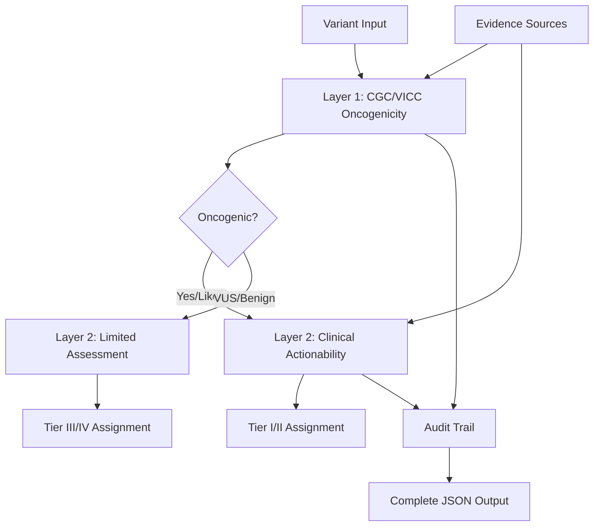

# Clinical Rules Implementation Blueprint V2
## Sequential Two-Layer Architecture

This document defines the updated implementation strategy for clinical variant interpretation, incorporating best practices from our analysis and aligning with the CGC/VICC 2022 recommendations for a **sequential, two-step process**.

## Executive Summary

Rather than attempting to merge multiple frameworks into a single tier assignment, we implement a **two-layer sequential architecture**:

1. **Layer 1: Biological Classification** (CGC/VICC 2022) - Determines if a variant is cancer-causing
2. **Layer 2: Clinical Actionability** (AMP/ASCO/CAP 2017 + OncoKB) - Determines clinical significance

This approach provides:
- Clear separation between biological effect and clinical utility
- Complete audit trail for regulatory compliance
- Modular architecture for maintainability
- Industry-standard implementation patterns

## Architecture Overview



## Layer 1: Foundational Oncogenicity Classification (CGC/VICC 2022)

### Purpose
Determine the fundamental biological impact of the variant using the five-tier CGC/VICC 2022 oncogenicity classification.

### Implementation Strategy

#### 1.1 Data Source Integration

Based on current best practices (2025), we integrate these primary resources:

```python
# src/annotation_engine/layer1/data_providers.py
class Layer1DataProviders:
    """Data providers for CGC/VICC oncogenicity assessment"""
    
    def __init__(self, kb_bundle_path: Path):
        self.providers = {
            # Hotspot Evidence (OS3, OM3, OP3)
            "hotspots": CancerHotspotsProvider(kb_bundle_path),
            "msk_impact": MSKImpactHotspotsProvider(kb_bundle_path),
            
            # Somatic Variant Frequencies
            "cosmic": COSMICProvider(kb_bundle_path),
            "pecanpie": PeCanPIEProvider(kb_bundle_path),  # Pediatric
            
            # Population Allele Frequency (SBVS1, SBS1)
            "gnomad": GnomADProvider(kb_bundle_path, version="v4.1"),
            
            # Expert Interpretations
            "clinvar": ClinVarSomaticProvider(kb_bundle_path),
            
            # Additional Evidence
            "oncokb_local": OncoKBLocalProvider(kb_bundle_path)
        }
```

#### 1.2 Rule Engine Implementation

Following industry best practice, rules are implemented in **validated, version-controlled code**:

```python
# src/annotation_engine/layer1/cgc_vicc_rules.py
class CGCVICCRuleEngine:
    """Implements CGC/VICC 2022 oncogenicity criteria"""
    
    def __init__(self, config: Layer1Config):
        self.config = config
        self.criteria_evaluators = {
            # Oncogenic Very Strong
            "OVS1": self.evaluate_OVS1,
            
            # Oncogenic Strong  
            "OS1": self.evaluate_OS1,
            "OS2": self.evaluate_OS2,
            "OS3": self.evaluate_OS3,
            
            # Oncogenic Moderate
            "OM1": self.evaluate_OM1,
            "OM2": self.evaluate_OM2,
            "OM3": self.evaluate_OM3,
            "OM4": self.evaluate_OM4,
            
            # Oncogenic Supporting
            "OP1": self.evaluate_OP1,
            "OP2": self.evaluate_OP2,
            "OP3": self.evaluate_OP3,
            "OP4": self.evaluate_OP4,
            
            # Benign criteria
            "SBVS1": self.evaluate_SBVS1,
            "SBS1": self.evaluate_SBS1,
            "SBS2": self.evaluate_SBS2,
            "SBP1": self.evaluate_SBP1
        }
    
    def evaluate_OS3(self, variant: Variant, evidence: Dict) -> CriterionResult:
        """OS3: Located at a well-established cancer hotspot"""
        
        hotspot_data = evidence.get("hotspots", {})
        
        # Check multiple hotspot sources
        is_cosmic_hotspot = hotspot_data.get("cosmic_samples", 0) >= 50
        is_msk_hotspot = hotspot_data.get("msk_impact_hotspot", False)
        is_cancerhotspots = hotspot_data.get("cancerhotspots_qvalue", 1.0) < 0.01
        
        if is_cosmic_hotspot or is_msk_hotspot or is_cancerhotspots:
            return CriterionResult(
                criterion="OS3",
                is_met=True,
                strength="Strong",
                evidence_sources=[
                    f"COSMIC: {hotspot_data.get('cosmic_samples', 0)} samples",
                    f"CancerHotspots q-value: {hotspot_data.get('cancerhotspots_qvalue', 'N/A')}"
                ],
                confidence=0.95
            )
        
        return CriterionResult(criterion="OS3", is_met=False)
```

#### 1.3 Classification Logic

```python
def classify_oncogenicity(self, criteria_results: List[CriterionResult]) -> OncogenicityClassification:
    """Apply CGC/VICC combination rules to determine final classification"""
    
    # Count criteria by strength
    met_criteria = [c for c in criteria_results if c.is_met]
    very_strong = sum(1 for c in met_criteria if c.strength == "Very Strong")
    strong = sum(1 for c in met_criteria if c.strength == "Strong")
    moderate = sum(1 for c in met_criteria if c.strength == "Moderate")
    supporting = sum(1 for c in met_criteria if c.strength == "Supporting")
    
    # Apply CGC/VICC combination rules
    if very_strong >= 1:
        return OncogenicityClassification.ONCOGENIC
    elif strong >= 2:
        return OncogenicityClassification.ONCOGENIC
    elif strong == 1 and moderate >= 2:
        return OncogenicityClassification.ONCOGENIC
    elif strong == 1 and moderate == 1 and supporting >= 2:
        return OncogenicityClassification.LIKELY_ONCOGENIC
    # ... additional combination rules
    
    return OncogenicityClassification.VUS
```

#### 1.4 Layer 1 Output Model

```json
{
  "layer1_oncogenicity_classification": {
    "classification": "Likely Oncogenic",
    "confidence": 0.85,
    "guideline": "CGC/VICC 2022",
    "criteria_met": [
      {
        "criterion": "OS3",
        "strength": "Strong",
        "description": "Located at well-established cancer hotspot",
        "evidence": {
          "source": "cancerhotspots.org",
          "details": "q-value: 0.0001, 156 samples"
        }
      },
      {
        "criterion": "OM4",
        "strength": "Moderate", 
        "description": "Missense in oncogene with supporting functional evidence",
        "evidence": {
          "source": "OncoKB",
          "details": "Gain-of-function mutation"
        }
      }
    ],
    "evidence_summary": {
      "strong_criteria": 1,
      "moderate_criteria": 1,
      "supporting_criteria": 0,
      "benign_criteria": 0
    }
  }
}
```

## Layer 2: Clinical Actionability Assessment (AMP/ASCO/CAP 2017)

### Purpose
Determine clinical significance and therapeutic implications, building upon the Layer 1 oncogenicity classification.

### Implementation Strategy

#### 2.1 Enhanced Data Providers

```python
# src/annotation_engine/layer2/data_providers.py
class Layer2DataProviders:
    """Data providers for clinical actionability assessment"""
    
    def __init__(self, kb_bundle_path: Path):
        self.providers = {
            # Therapeutic Evidence
            "oncokb_therapeutic": OncoKBTherapeuticProvider(kb_bundle_path),
            "civic": CIViCProvider(kb_bundle_path),
            
            # Clinical Trials
            "clinicaltrials": ClinicalTrialsProvider(kb_bundle_path),
            
            # Guidelines
            "nccn": NCCNGuidelinesProvider(kb_bundle_path),
            
            # Internal Resources
            "internal_db": InternalKnowledgeProvider(kb_bundle_path)
        }
```

#### 2.2 Integrated Rule Engine

```python
# src/annotation_engine/layer2/amp_asco_cap_rules.py
class AMPASCOCAPRuleEngine:
    """Implements AMP/ASCO/CAP 2017 with Layer 1 integration"""
    
    def assign_tier(self, 
                    variant: Variant,
                    layer1_result: OncogenicityClassification,
                    clinical_evidence: Dict) -> ClinicalTier:
        """Assign clinical tier using Layer 1 result as foundation"""
        
        # Layer 1 result influences tier assignment
        if layer1_result.classification in ["Benign", "Likely Benign"]:
            # Benign variants -> Tier IV regardless of other evidence
            return self._assign_tier_iv(variant, layer1_result, clinical_evidence)
        
        # Check therapeutic evidence for oncogenic variants
        therapeutic_evidence = self._evaluate_therapeutic_evidence(
            variant, clinical_evidence
        )
        
        # FDA-approved therapy -> Tier I
        if therapeutic_evidence.fda_approved and layer1_result.is_oncogenic:
            return ClinicalTier(
                tier="Tier I",
                level="A",
                justification="FDA-approved therapy for oncogenic variant",
                layer1_support=layer1_result
            )
        
        # Professional guidelines -> Tier I
        if therapeutic_evidence.in_guidelines and layer1_result.is_oncogenic:
            return ClinicalTier(
                tier="Tier I", 
                level="B",
                justification="Included in professional guidelines",
                layer1_support=layer1_result
            )
        
        # Clinical trials -> Tier II
        if therapeutic_evidence.clinical_trials and layer1_result.is_likely_oncogenic:
            return ClinicalTier(
                tier="Tier II",
                level="C",
                justification="Clinical trial evidence available",
                layer1_support=layer1_result
            )
        
        # VUS with no actionability -> Tier III
        if layer1_result.classification == "VUS":
            return ClinicalTier(
                tier="Tier III",
                justification="Variant of uncertain significance",
                layer1_support=layer1_result
            )
        
        # Default based on oncogenicity
        return self._assign_default_tier(layer1_result, clinical_evidence)
```

#### 2.3 OncoKB Integration

```python
def _integrate_oncokb_levels(self, 
                            oncokb_level: str,
                            layer1_result: OncogenicityClassification) -> Dict:
    """Map OncoKB levels to tiers with Layer 1 consideration"""
    
    mapping = {
        # Tier I assignments require oncogenic classification
        "1": {"tier": "I", "requires_oncogenic": True},
        "2": {"tier": "I", "requires_oncogenic": True},
        
        # Tier II can work with likely oncogenic
        "3A": {"tier": "II", "requires_oncogenic": False},
        "3B": {"tier": "II", "requires_oncogenic": False},
        
        # Tier III for biological evidence
        "4": {"tier": "III", "requires_oncogenic": False}
    }
    
    tier_info = mapping.get(oncokb_level, {"tier": "III"})
    
    # Validate oncogenicity requirement
    if tier_info.get("requires_oncogenic") and not layer1_result.is_oncogenic:
        # Downgrade tier if oncogenicity requirement not met
        return {"tier": "III", "note": "Downgraded due to uncertain oncogenicity"}
    
    return tier_info
```

## Complete Output Model

### Final Integrated JSON Structure

```json
{
  "variant_annotation": {
    "variant": {
      "gene": "BRAF",
      "hgvsp": "p.Val600Glu",
      "chromosome": "7",
      "position": 140453136,
      "ref": "T",
      "alt": "A"
    },
    "cancer_type": "Melanoma",
    "analysis_metadata": {
      "engine_version": "3.0.0",
      "timestamp": "2025-06-18T10:30:00Z",
      "guidelines_used": ["CGC/VICC 2022", "AMP/ASCO/CAP 2017", "OncoKB"]
    }
  },
  
  "clinical_classification": {
    "final_tier": "Tier I",
    "evidence_level": "A",
    "clinical_significance": "Strong clinical significance",
    "actionability": {
      "therapeutic": {
        "fda_approved_therapies": [
          {
            "drug": "Dabrafenib + Trametinib",
            "indication": "BRAF V600E-mutant melanoma",
            "approval_date": "2014-01-10"
          }
        ],
        "resistance_implications": [],
        "clinical_trials": []
      },
      "diagnostic": {
        "implications": "Confirms BRAF-mutant melanoma subtype"
      },
      "prognostic": {
        "implications": "Associated with specific treatment response patterns"
      }
    }
  },
  
  "layer2_evidence": {
    "guideline": "AMP/ASCO/CAP 2017",
    "evidence_items": [
      {
        "source": "OncoKB",
        "level": "1",
        "type": "Therapeutic",
        "description": "FDA-approved targeted therapy available"
      },
      {
        "source": "NCCN Guidelines",
        "level": "Category 1",
        "type": "Therapeutic",
        "description": "Recommended first-line therapy"
      }
    ],
    "tier_justification": "Tier I assignment based on FDA-approved biomarker with Level A evidence"
  },
  
  "layer1_oncogenicity": {
    "classification": "Oncogenic",
    "confidence": 0.98,
    "guideline": "CGC/VICC 2022",
    "criteria_met": [
      {
        "criterion": "OS1",
        "strength": "Strong",
        "description": "Missense variant at same amino acid position as known oncogenic variant",
        "evidence_source": "ClinVar"
      },
      {
        "criterion": "OS3",
        "strength": "Strong",
        "description": "Located at well-established cancer hotspot",
        "evidence_source": "cancerhotspots.org"
      }
    ],
    "evidence_summary": {
      "strong_criteria": 2,
      "moderate_criteria": 0,
      "supporting_criteria": 1,
      "benign_criteria": 0
    }
  },
  
  "quality_metrics": {
    "evidence_completeness": 0.95,
    "confidence_score": 0.92,
    "missing_evidence_types": ["functional_studies"],
    "data_sources_queried": 12,
    "warnings": []
  }
}
```

## Implementation Timeline

### Phase 1: Layer 1 Implementation (Weeks 1-3)
- Implement CGC/VICC criteria evaluators
- Integrate hotspot and frequency data providers
- Build classification logic
- Create comprehensive test suite

### Phase 2: Layer 2 Implementation (Weeks 4-6)
- Implement AMP/ASCO/CAP tier assignment
- Integrate OncoKB and CIViC providers
- Build Layer 1-2 integration logic
- Add clinical actionability assessment

### Phase 3: Integration & Validation (Weeks 7-8)
- End-to-end testing with real variants
- Performance optimization
- Clinical validation with test cases
- Documentation and deployment

## Key Advantages of This Approach

1. **Clear Separation of Concerns**: Biological impact (Layer 1) vs clinical utility (Layer 2)
2. **Audit Trail**: Complete evidence tracking for regulatory compliance
3. **Flexibility**: Can update layers independently as guidelines evolve
4. **Industry Alignment**: Follows CGC/VICC recommended sequential approach
5. **Maintainability**: Modular architecture with clear interfaces

## Configuration Management

While the core logic remains in validated code, we maintain flexibility through configuration:

```yaml
# config/layer1_thresholds.yaml
hotspot_thresholds:
  cosmic_min_samples: 50
  cancerhotspots_max_qvalue: 0.01
  msk_impact_min_samples: 10

population_frequency:
  gnomad_max_af: 0.001
  require_all_populations: true

# config/layer2_mappings.yaml  
oncokb_tier_mapping:
  level_1: "Tier I"
  level_2: "Tier I"
  level_3A: "Tier II"
  level_3B: "Tier II"
  level_4: "Tier III"
  
evidence_requirements:
  tier_i_requires_oncogenic: true
  tier_ii_accepts_likely_oncogenic: true
```

This architecture provides a robust, maintainable, and clinically valid implementation that aligns with current best practices and regulatory requirements.